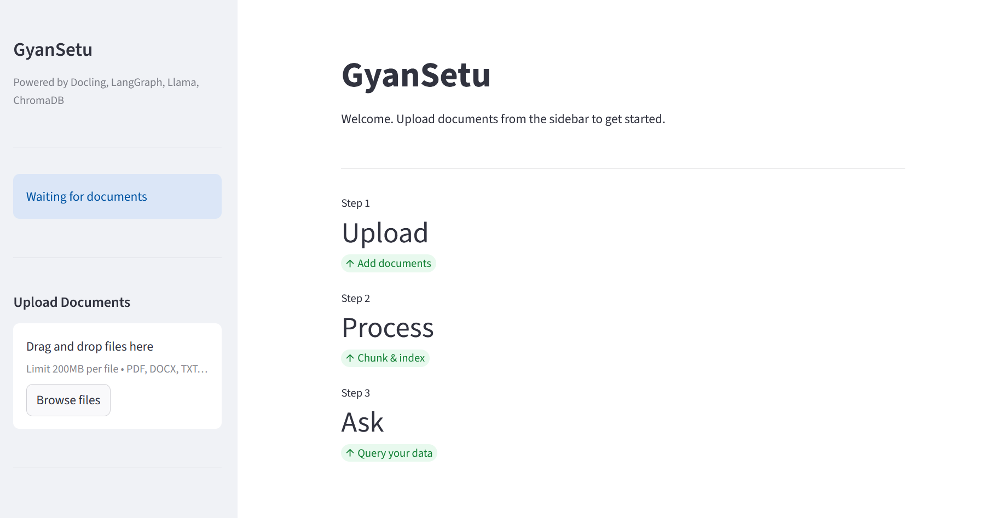
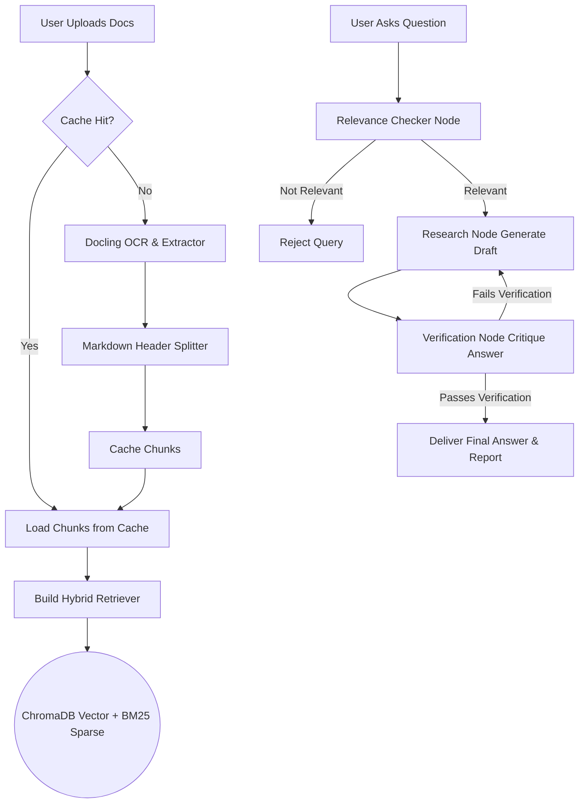

# GyanSetu 


**GyanSetu** is an advanced, fully autonomous **Retrieval-Augmented Generation (RAG)** system designed to intelligently query and interact with your documents. Powered by large language models (via Groq/Llama), semantic vector search (ChromaDB), and a multi-agent orchestrated workflow (LangGraph), GyanSetu goes beyond simple similarity search. It introduces self-verification, relevance checking, and dynamic answer refinement to ensure highly accurate, hallucination-free responses.

---

##  Key Features

### 1.  Agentic QA Pipeline (Self-Reflective RAG)
Instead of a simple "retrieve-and-generate" approach, GyanSetu orchestrates a multi-step agent workflow:
- **Relevance Checker:** Instantly filters out questions entirely unrelated to the uploaded context, saving tokens and computing time.
- **Research Agent:** Synthesizes the retrieved context and formulates a comprehensive draft answer.
- **Verification Agent (Critic):** Automatically critiques the draft answer against the retrieved context to ensure no hallucinations occurred.
- **Self-Healing Loop:** If the verification agent flags the answer as unsupported or irrelevant, the system routes the task back to the research agent for corrections, ensuring maximum fidelity.

### 2.  Advanced Hybrid Retrieval
Combines the best of two search paradigms:
- **Dense Retrieval (Semantic Search):** Uses HuggingFace `BAAI/bge-base-en-v1.5` embeddings and **ChromaDB** to understand the contextual meaning of queries.
- **Sparse Retrieval (Keyword Search):** Uses **BM25** to catch exact keyword matches (vital for jargon, names, and acronyms).
- **Ensemble Retriever:** Weighted combination (default 60% semantic, 40% keyword) to yield the most contextually relevant chunks.

### 3.  Intelligent Document Processing
- **Robust OCR & Parsing:** Leverages **Docling** to accurately process complex PDFs and Word documents, preserving structure and layout.
- **Semantic Chunking:** Converts documents to Markdown and splits them based on Markdown Headers (`#`, `##`), maintaining the hierarchical integrity and logical flow of the text rather than blindly chopping paragraphs mid-sentence.

### 4.  Smart Caching System
- Implements a hashlib-based caching mechanism. Before running expensive OCR or conversions, the system hashes the file.
- If a document has already been processed within the expiration window (7 days), the system instantly loads chunks from a local serialized `.pkl` cache—drastically speeding up app reloads and repetitive document uploads.

---

##  Architecture Overview



---

##  Technology Stack

- **UI Framework:** Streamlit
- **Agent Orchestration:** LangGraph (StateGraph)
- **LLM Provider:** Groq (Default Model: `llama-3.3-70b-versatile`)
- **Document Processing:** Docling, LangChain MarkdownHeaderTextSplitter
- **Embeddings:** HuggingFace (`BAAI/bge-base-en-v1.5`)
- **Vector Database:** ChromaDB
- **Retrieval:** Rank-BM25, LangChain EnsembleRetriever

---

##  Project Structure

```bash
Gyan Setu/
│
├── app.py                      # Main Streamlit application entry point
├── requirements.txt            # Python dependencies
├── README.md                   # Project documentation
│
├── config/                     # Configuration and constants
│   ├── settings.py             # Pydantic environment configurations
│   ├── constants.py            # Static variables and limits
│   └── __init__.py
│
├── Doc_processor/              # Document extraction and chunking logic
│   ├── file_handler.py         # Caching, Docling extraction, and chunking
│   └── __init__.py
│
├── retriever/                  # Information retrieval modules
│   ├── vectordb.py             # ChromaDB + BM25 Hybrid Builder
│   └── __init__.py
│
├── agents/                     # LangGraph Nodes and Agents
│   ├── workflow.py             # LangGraph StateGraph pipeline orchestration
│   ├── research_agent.py       # Summarizes and answers user queries
│   ├── verification_agent.py   # Critiques and verifies the draft answer
│   ├── relevance_checker.py    # Prevents off-topic inputs
│   └── __init__.py
│
└── utils/                      # Helper scripts
    └── logging.py              # Application-wide logger configuration
```

---

##  Setup & Installation

Follow these steps to set up the project locally.

### 1. Clone the repository
```bash
git clone <repository_url>
cd "Doc Cortex"
```

### 2. Create and Activate Virtual Environment
```bash
python -m venv venv
# On Windows:
venv\Scripts\activate
# On Mac/Linux:
source venv/bin/activate
```

### 3. Install Dependencies
```bash
pip install -r requirements.txt
```

### 4. Configure Environment Variables
Create a `.env` file in the root directory and add your API keys:
```env
GROQ_API_KEY=your_groq_api_key_here
```
*(You can also adjust parameters like `CHUNK_SIZE`, `CACHE_EXPIRE_DAYS`, or `LOG_LEVEL` inside `config/settings.py` or the `.env` file.)*

### 5. Run the Application
```bash
streamlit run app.py
```
The application will be accessible via your browser at `http://localhost:8501`.

---

## How to Use

1. **Upload Documents:** Navigate to the sidebar and upload your `.pdf`, `.docx`, `.md`, or `.txt` files.
2. **Process:** Click on "Process Documents". The system will cache and chunk the files, and build the retrieval index. 
3. **Ask Questions:** Once indexed, utilize the chat interface on the main screen to query your customized knowledge base.
4. **View Verification:** After GyanSetu answers, you can click on the `Verification Report` expander to see the underlying chain of thought, evaluation matrix, and why the answer was deemed accurate by the internal Critic Agent.

---
