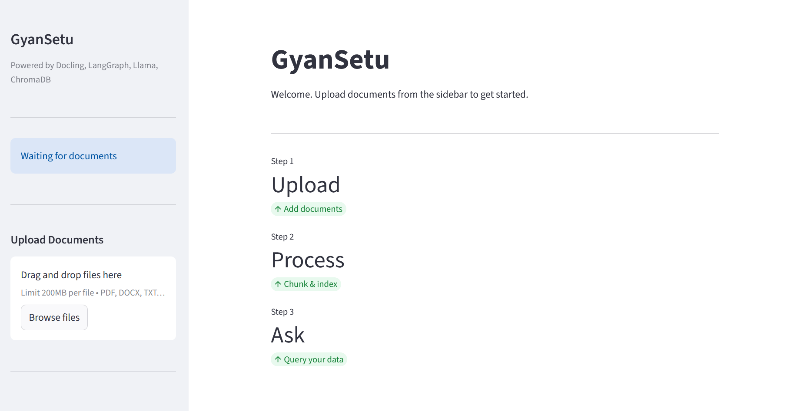
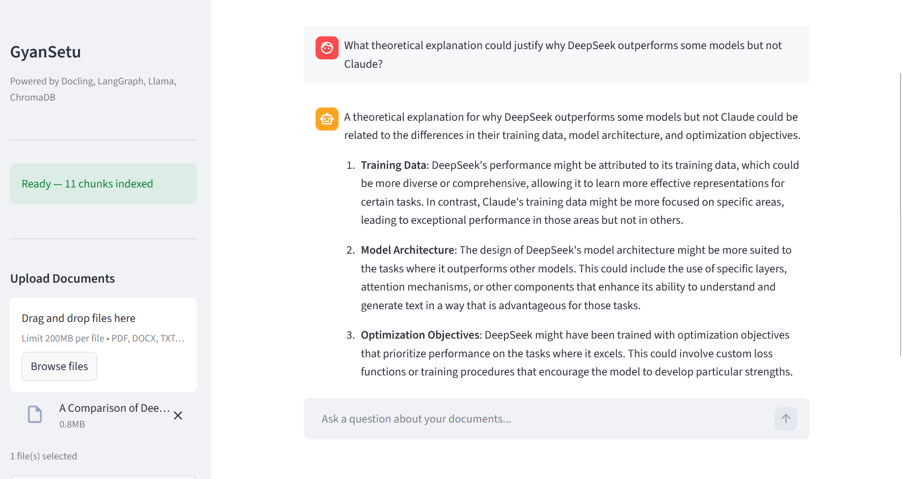
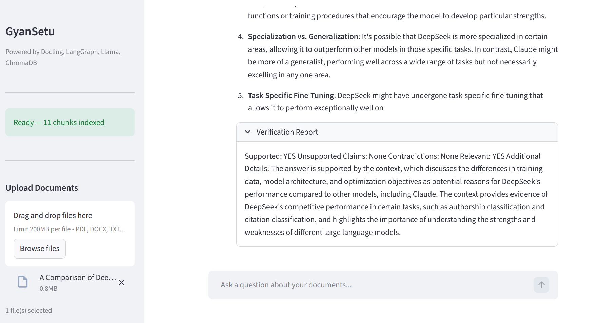

<h1 align="center">GyanSetu</h1>

  A multi-agent RAG system for document-based question answering with hybrid retrieval, answer verification, and self-correction.

  

<h2>Overview</h2>

  GyanSetu is a Retrieval-Augmented Generation system designed to answer questions from uploaded documents.
  It processes documents, builds a searchable knowledge base, retrieves relevant context, generates answers, and verifies whether the answer is supported by the retrieved information.

  The project uses a LangGraph-based multi-agent workflow instead of a simple retrieve-and-generate pipeline.
  This helps improve answer quality, reduce unsupported responses, and make the system more reliable for document-heavy use cases.

<h2>Performance Highlights</h2>

<table>
  <tr>
    <th>Area</th>
    <th>Result</th>
  </tr>
  <tr>
    <td><strong>Correctness</strong></td>
    <td>
      <mark><strong>Improved from 0.14 to 0.71</strong></mark> on LangSmith benchmark evaluations.
    </td>
  </tr>
  <tr>
    <td><strong>Groundedness</strong></td>
    <td>
      <mark><strong>Improved from 0.00 to 1.00</strong></mark>, showing stronger context-supported answers.
    </td>
  </tr>
  <tr>
    <td><strong>Answer Quality</strong></td>
    <td>
      Achieved a <mark><strong>5x improvement</strong></mark> over the base pipeline.
    </td>
  </tr>
  <tr>
    <td><strong>Latency</strong></td>
    <td>
      Reduced pipeline latency from <strong>0.50s P50</strong> to <mark><strong>0.27s P50</strong></mark>.
    </td>
  </tr>
  <tr>
    <td><strong>Speed Improvement</strong></td>
    <td>
      Achieved a <mark><strong>46% latency reduction</strong></mark> compared to the earlier pipeline.
    </td>
  </tr>
  <tr>
    <td><strong>Retrieval Precision</strong></td>
    <td>
      Improved retrieval precision by <mark><strong>40%</strong></mark> using hybrid search.
    </td>
  </tr>
  <tr>
    <td><strong>Corpus Size</strong></td>
    <td>
      Tested on a <mark><strong>200MB+ document corpus</strong></mark>.
    </td>
  </tr>
  <tr>
    <td><strong>Evaluation Runtime</strong></td>
    <td>
      Recorded <mark><strong>19.33s P50</strong></mark> and <mark><strong>22.23s P99</strong></mark> end-to-end LangSmith evaluation runtime.
    </td>
  </tr>
</table>

<h2>Core Features</h2>

<h3>Multi-Agent RAG Workflow</h3>

<ul>
  <li>
    <strong>Relevance Checker:</strong> Filters questions that are not related to the uploaded documents.
  </li>
  <li>
    <strong>Research Agent:</strong> Generates answers using retrieved document context.
  </li>
  <li>
    <strong>Verification Agent:</strong> Checks whether the generated answer is supported by the retrieved context.
  </li>
  <li>
    <strong>Self-Correction Loop:</strong> Refines weak or unsupported answers before returning the final response.
  </li>
</ul>

<h3>Hybrid Retrieval</h3>

<ul>
  <li>
    Uses <strong>ChromaDB</strong> for vector-based semantic retrieval.
  </li>
  <li>
    Uses <strong>BM25</strong> for keyword-based sparse retrieval.
  </li>
  <li>
    Combines both retrieval methods to improve context selection and reduce missed information.
  </li>
</ul>

<h3>Document Processing</h3>

<ul>
  <li>
    Supports PDF, DOCX, Markdown, and text files.
  </li>
  <li>
    Uses Docling for document extraction and OCR-based processing.
  </li>
  <li>
    Converts documents into structured chunks for better retrieval.
  </li>
  <li>
    Uses caching to avoid repeated processing of the same files.
  </li>
</ul>

<h3>Evaluation and Monitoring</h3>

<ul>
  <li>
    Integrated LangSmith for benchmark evaluation and workflow tracing.
  </li>
  <li>
    Tracks correctness, groundedness, latency, and retrieval quality.
  </li>
  <li>
    Provides verification reports to show whether an answer is supported by the retrieved context.
  </li>
</ul>

<h2>Architecture</h2>

<pre>
Uploaded Documents
        |
        v
Cache Check
        |
        v
Document Processing with Docling
        |
        v
Markdown-based Chunking
        |
        v
Hybrid Retriever
ChromaDB Vector Search + BM25 Sparse Search
        |
        v
User Query
        |
        v
Relevance Checker
        |
        v
Research Agent
        |
        v
Verification Agent
        |
        v
Final Answer or Self-Correction
</pre>

<h2>Demo Screenshots</h2>

<h3>Query Interface</h3>

  

<h3>Verification Report</h3>

  

<h2>Technology Stack</h2>

<table>
  <tr>
    <th>Category</th>
    <th>Tools Used</th>
  </tr>
  <tr>
    <td><strong>Frontend</strong></td>
    <td>Streamlit</td>
  </tr>
  <tr>
    <td><strong>Agent Workflow</strong></td>
    <td>LangGraph StateGraph</td>
  </tr>
  <tr>
    <td><strong>LLM</strong></td>
    <td>Groq, Llama 3.3 70B</td>
  </tr>
  <tr>
    <td><strong>Document Processing</strong></td>
    <td>Docling, LangChain MarkdownHeaderTextSplitter</td>
  </tr>
  <tr>
    <td><strong>Embeddings</strong></td>
    <td>HuggingFace BAAI/bge-base-en-v1.5</td>
  </tr>
  <tr>
    <td><strong>Vector Database</strong></td>
    <td>ChromaDB</td>
  </tr>
  <tr>
    <td><strong>Keyword Search</strong></td>
    <td>BM25, Rank-BM25</td>
  </tr>
  <tr>
    <td><strong>Evaluation</strong></td>
    <td>LangSmith</td>
  </tr>
  <tr>
    <td><strong>Configuration</strong></td>
    <td>Pydantic, environment variables</td>
  </tr>
</table>

<h2>Project Structure</h2>

<pre>
GyanSetu/
|
├── app.py
├── requirements.txt
├── README.md
|
├── config/
│   ├── settings.py
│   ├── constants.py
│   └── __init__.py
|
├── Doc_processor/
│   ├── file_handler.py
│   └── __init__.py
|
├── retriever/
│   ├── vectordb.py
│   └── __init__.py
|
├── agents/
│   ├── workflow.py
│   ├── research_agent.py
│   ├── verification_agent.py
│   ├── relevance_checker.py
│   └── __init__.py
|
└── utils/
    └── logging.py
</pre>

<h2>Setup and Installation</h2>

<h3>1. Clone the repository</h3>

<pre>
git clone https://github.com/SPPandey23/GyanSetu-.git
cd GyanSetu-
</pre>

<h3>2. Create a virtual environment</h3>

<pre>
python -m venv venv
</pre>

<h3>3. Activate the virtual environment</h3>

On Windows:

<pre>
venv\Scripts\activate
</pre>

On macOS or Linux:

<pre>
source venv/bin/activate
</pre>

<h3>4. Install dependencies</h3>

<pre>
pip install -r requirements.txt
</pre>

<h3>5. Configure environment variables</h3>

  Create a <code>.env</code> file in the root directory and add your API key:

<pre>
GROQ_API_KEY=your_groq_api_key_here
</pre>

<h3>6. Run the application</h3>

<pre>
streamlit run app.py
</pre>

  The application will start at <code>http://localhost:8501</code>.

<h2>How to Use</h2>

<ol>
  <li>Upload PDF, DOCX, Markdown, or text files from the sidebar.</li>
  <li>Click <strong>Process Documents</strong> to extract, chunk, cache, and index the files.</li>
  <li>Ask questions from the chat interface.</li>
  <li>Review the verification report to check whether the answer is supported by the retrieved context.</li>
</ol>

<h2>Why This Project</h2>

  Many document question-answering systems generate fluent responses even when the answer is not strongly supported by the source material.
  GyanSetu addresses this by adding relevance filtering, hybrid retrieval, and a verification step before the final answer is returned.

  This makes the system useful for academic documents, reports, technical files, policy documents, and other cases where answers need to stay grounded in uploaded content.

<h2>Author</h2>

  <strong>Soorya Prakash Pandey</strong> 
  B.Tech in Artificial Intelligence and Machine Learning 
  Madhav Institute of Technology and Science, Gwalior

